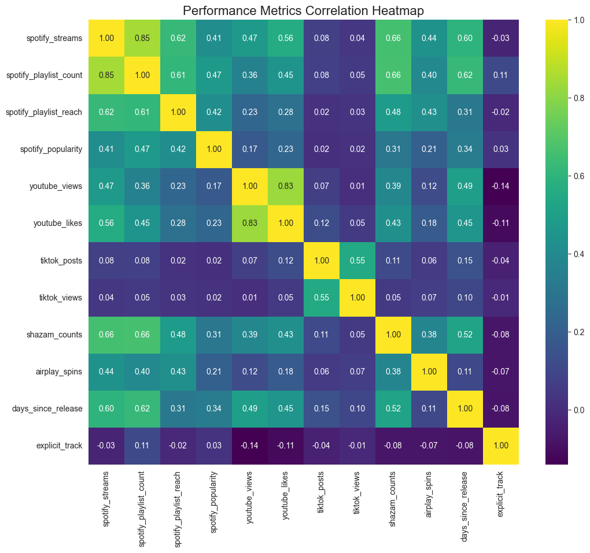
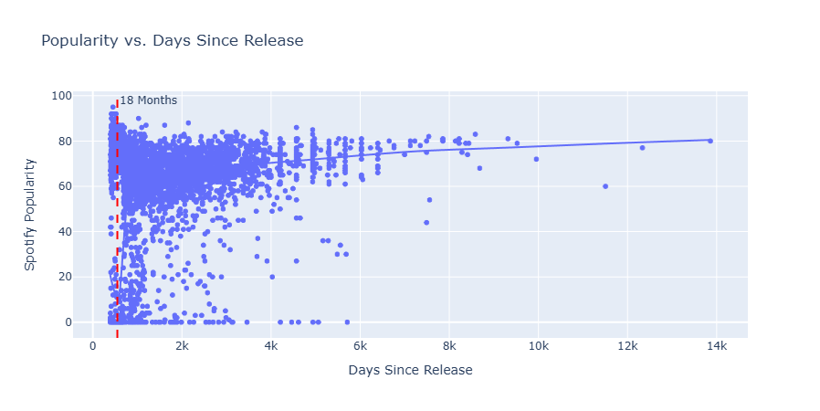
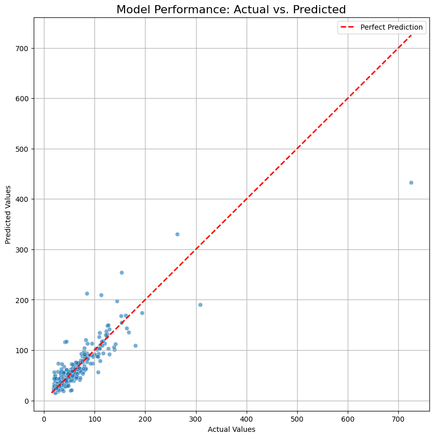

# Analysis of Spotify's Most Streamed Songs 2024

## 1. Project Description and Objectives

This is an end-to-end data science project that performs a full-scale analysis on the "Most Streamed Spotify Songs 2024" dataset from Kaggle. The project encompasses the entire data lifecycle: automated data ingestion, robust data cleaning and preparation, in-depth exploratory data analysis (EDA), hypothesis testing, predictive modeling, and deployment of a live, interactive web application.

The project is structured to answer key business questions relevant to the music industry:
- **Performance & Virality Analysis:** The primary objective is to identify the key metrics that drive a song's success across multiple platforms (Spotify, YouTube, TikTok) and understand the mechanics of how songs become viral hits.
- **Predictive Modeling:** A second objective is to develop a machine learning model capable of predicting a song's potential success (`track_score`) based on its early performance indicators. This serves as a decision-support tool for A&R and marketing teams.

The final deliverable is a Flask web application featuring an insights dashboard and a **Predictive Simulator**, where users can input a song's metrics and receive a real-time prediction of its success potential.

---

## 2. Project Structure

The project follows a modular and scalable structure, separating concerns into distinct directories for clarity and maintainability.

```bash
Spotify-2024-Data-Analysis/
├── app.py               # Main Flask Web Application file
├── data/                # Contains all raw and processed data
├── dictionary/          # Holds the Data Dictionary describing variables
├── models/              # Stores saved Machine Learning model artifacts
├── notebooks/           # Jupyter Notebooks for analysis, exploration, and reporting
├── reports/             # For generated reports and saved plots for documentation
├── scripts/             # Standalone, executable scripts for automation
├── src/                 # Reusable source code (our project's Python library)
├── static/              # Static assets for the web app (CSS, etc.)
├── templates/           # HTML templates for the Flask app
├── requirements.txt     # List of all Python dependencies for the project
└── .gitignore           # Specifies files and folders to be ignored by Git
```

---

## 3. Data Cleaning and Preparation

The raw dataset presented several data quality challenges that required a robust cleaning pipeline before any analysis could be performed.

- **Automated Data Ingestion:** A script was developed to automatically download the dataset from Kaggle via its API, handling proxy configurations for corporate environments.
- **Advanced Encoding Repair:** The raw data contained complex character encoding errors ("mojibake") and invalid placeholder characters. An industrial-grade ingestion process was built using the `chardet` and `ftfy` libraries to detect and repair text line-by-line before creating the DataFrame.
- **Standardization & Deduplication:** Column names were standardized to a consistent `snake_case` format. A sophisticated de-duplication strategy was implemented to remove logical duplicates (e.g., different versions of the same song) by keeping only the entry with the highest stream count for each unique track title.
- **Type Conversion & Missing Values:** All performance metrics were converted to appropriate numeric types (`int64`, `float64`), and missing values were handled with a defined strategy (e.g., filling with 0 for performance counts).
- **[Click here to see the Data Cleaning Logic](src/data_processing.py)**

---

## 4. Key Insights from Analysis

The Exploratory Data Analysis (EDA) and Hypothesis Testing notebooks revealed several strategic insights into the mechanics of the modern music industry.

- **Playlisting is King on Spotify:** The single strongest predictor of a song's total streams is its inclusion in a high volume of playlists. `spotify_playlist_count` has an exceptionally high correlation (0.85) with `spotify_streams`.
- **The Multi-Platform Ecosystem:** Success is not siloed. An artist's streaming rank on Spotify is highly correlated (0.68 Spearman) with their viewership rank on YouTube. However, different platforms play different roles; TikTok appears to be a powerful engine for *discovery*, while YouTube is a stronger indicator of direct *streaming conversion*.
- **The 18-Month Popularity Window:** A song's "buzz" or `spotify_popularity` score decays sharply after the first 18 months of its release, after which it becomes a "catalog" track. This defines a critical window for marketing efforts.
- **Explicit Content is No Barrier:** In the digital streaming world, explicit tracks show no disadvantage in achieving massive stream counts compared to non-explicit tracks, though they have significantly less reach on traditional radio (`airplay_spins`).
- **[Click here to see the full EDA Notebook](notebooks/01_eda.ipynb)** | **[Click here to see the Hypothesis Testing](notebooks/02_HypothesisTesting.ipynb)**

<p align="center">
  
  <br><em>Correlation heatmap showing relationships between platform metrics.</em>
</p>
<p align="center">
  
  <br><em>The trendline shows popularity decaying significantly in the first 18 months.</em>
</p>

---

## 5. Predictive Modeling

A predictive model was developed to forecast a song's potential success, measured by `track_score`.

- **Model Choice:** An `XGBoost Regressor` was chosen for its high performance, speed, and interpretability.
- **Performance:** The final model demonstrated high predictive power on unseen test data, achieving an **R-squared (R²) score of 0.94**, meaning it can explain 94% of the variance in the `track_score`.
- **Feature Importance:** The analysis revealed that Spotify's internal metrics (`spotify_streams`, `spotify_playlist_reach`) are by far the most important predictors of a song's overall success score.
- **[Click here to see the Modeling Notebook](notebooks/04_PredictiveModeling.ipynb)**

<p align="center">
  
  <br><em>Feature importance from the trained XGBoost model.</em>
</p>

---

## 6. How to Run the Project

Follow these steps to set up and run the entire project on your local machine.

### Prerequisites
- Python 3.12+
- Git

### Installation and Setup

1.  **Clone the repository:**
```bash
    git clone https://github.com/ludmuniz/Spotify-2024-Data-Analysis.git
    cd Spotify-2024-Data-Analysis
```

2.  **Create and activate a virtual environment:**
```bash
    # Create the environment
    python -m venv venv
    
    # Activate the environment (on Windows)
    .\venv\Scripts\activate
```

3.  **Install dependencies:**
```bash
    pip install -r requirements.txt
```

### Running the End-to-End Pipeline

4.  **Configure Kaggle API:**
    -   Place your `kaggle.json` API token in `C:\\Users\\<Your-Username>\\.kaggle\\`.

5.  **Configure Proxy (Optional):**
    -   If behind a corporate firewall, open `src/config.py` and set the `PROXY_URL` variable.

6.  **Run the Full Pipeline with a Single Command:**
    -   This script will download, clean, and train the model in one go.
```bash
    python scripts/run_pipeline.py
```

### Launching the Web Application

7.  **Run the Flask App:**
    -   Ensure the pipeline (Step 6) has been run successfully at least once.
```bash
    python app.py
```

8.  **Access the Application:**
    -   Open your web browser and navigate to **http://127.0.0.1:5001/**.
    -   Explore the **Dashboard** and use the **Predictive Simulator**.

---

## 7. Technologies Used
-   **Python 3.12**
-   **Data Stack:** Pandas, NumPy
-   **Machine Learning:** Scikit-learn, XGBoost, Statsmodels
-   **Data Visualization:** Matplotlib, Seaborn, Plotly, WordCloud
-   **Web Framework:** Flask
-   **Data Ingestion & Cleaning:** Kaggle API, ftfy, chardet
-   **Development:** Jupyter Lab, Git, Visual Studio Code
